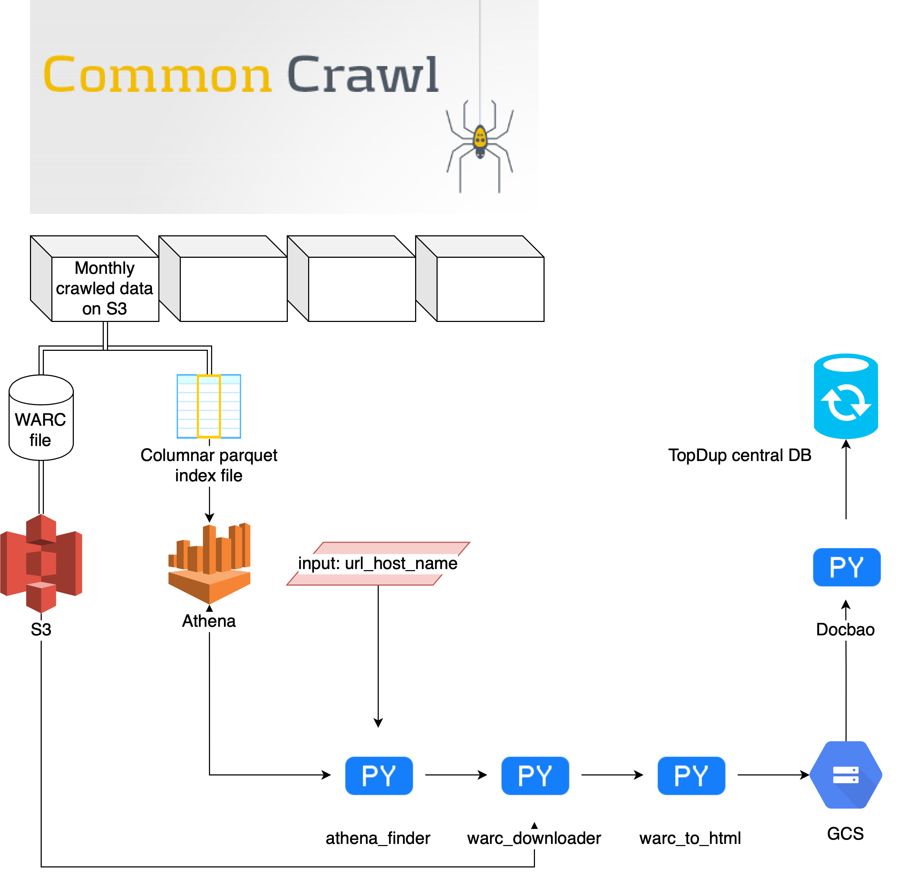

# Common Crawler

Công cụ tải số lượng lớn nội dung web từ CommonCrawl.

Lưu ý: flow của chương trình đang rời rạc, chưa kết nối thành pipeline hoặc class.

---

## Kiến trúc

---

## Các bước chuẩn bị

1. Đăng ký tài khoản AWS và nhập key_id, key_secret vào config.py.
2. Cài đặt AWS CLI.
3. Thiết lập bảng index của CommonCrawl (CC) trên AWS Athena theo [hướng dẫn này.](https://commoncrawl.org/2018/03/index-to-warc-files-and-urls-in-columnar-format/)

---

## Thực thi

### Bước 1: Xác định danh sách các files trên S3 liên quan đến domain.

#### 1.1: Xác định url_host_name.

CC không có một quy luật cố định cho việc định tên url_host_name, do đó, trong một số trường hợp với một domain https://domain.com thì ở trường dữ liệu url_host_name họ để nhiều giá trị như "domain", "domain.com" hoặc cả "https://domain.com".

Hiện tại, giải pháp cho vấn đề này là sử dụng Athena để query số lượng trang tồn tại trong CC dựa trên trường url_host_2nd_last_part. Đây không phải là một giải pháp tuyết đối chính xác, nó chỉ dựa trên quan sát rằng CC thường có quy luật nhất quán với phần thứ hai của một domain, ví dụ, để tìm url_host_name của https://domain.com thì url_host_2nd_last_part sẽ là "domain".

Tất nhiên, nên có giải pháp tự động hơn.

#### 1.2: Chạy athena_finder với url_host_name được xác định ở trên, kết quả thu được là một bảng chứa tên file data và url tương ứng.

### Bước 2: Tải data từ S3 theo danh sách về local storage.

Để lọc những urls chứa nội dung từ domain mong muốn, user có thể viết regex để lọc trong warc_downloader; nếu không có regex thì tất cả urls sẽ được tải xuống.

### Bước 3: Chuyển đổi file WARC thành HTML.
